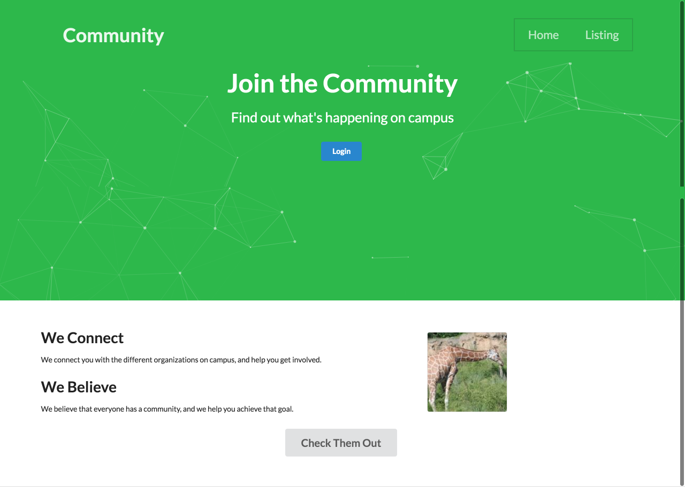

## Welcome to Community
The place to find your community on campus. With Community, you won't have to feel so alone anymore. People can filter for communities based on their interests, and get more information about those specific communities. Information such as the name of the community, when and where the community meets, and what the community does. Registered individuals can input information about their organization, and let everyone know about certain information they would like shown.

## User Guide
First you arrive on the landing page and log in using your UH login information. Once logged in you arrive at the filter page. On this page you can add clubs to your favorites, view clubs that you have favorited and you can filter clubs based on club names and interests. On the menu bar you can access your profile, the filter page, and the club admin page if you are an admin of a club. If you go to the club admin page you can adjust the information of the club you are the admin of. If you go to your profile page you can adjust the information of your profile to show what your interests are and your favorite clubs. Each club has their own page and you can add a like to that club or add some comments on the club's page. 

## Screenshots

[Link](http://community.meteorapp.com/)

[Link](http://community.meteorapp.com/tcchong/profile)

[Link](http://community.meteorapp.com/tcchong/filter)

Admin Page is in the project, but unavailable for screenshots due to login issues.

## Developer Guide
For those who want to use and modify our program: 

### Installing

Step 1: Make sure you have Meteor downloaded.

Step 2: Download our project at our GitHub site.

Step 3: Enter the app directory of the project and install libraries using: $ meteor npm install

Step 4: Run the program using: % meteor npm run start 

### Modifying

You can modify our program by first downloading it from our GitHub site and using an IDE to edit the code.

## Community Feedback

"You should add censorship" - UH Student

"Looks pretty shitty" - UH Student

"Phillip Johnson Approved" - UH Student

"Pretty useful" - UH Student

"Thank goodness for this site!  Much beter than looking up clubs in the schools excel sheet..." - UH Student

"Can find clubs good brah. I like the ability to comment on clubs and see what people think." - UH Student

## Links
[Organization](https://github.com/uhcommunity)

[M1 Project Page](https://github.com/uhcommunity/Community/projects/1)

[M2 Project page](https://github.com/uhcommunity/Community/projects/2)

[Deployment](http://community.meteorapp.com/)
