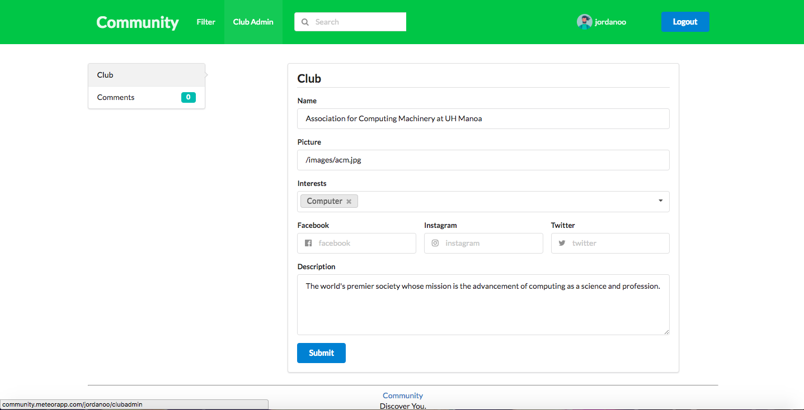

## Welcome to Community
The place to find your community on campus. With Community, you won't have to feel so alone anymore. People can filter for communities based on their interests, and get more information about those specific communities. Information such as the name of the community, when and where the community meets, and what the community does. Registered individuals can input information about their organization, and let everyone know about certain information they would like shown.

## User Guide

First you arrive on the landing page. Here you can see our goal and what we believe in. You can login by clicking the Get Involved button in the middle of the screen.

[Link](http://community.meteorapp.com/)

Once you log in you arrive at the filter page. On this page you can filter out other clubs based on their interests and search for clubs with their name. You can click on the club admin tab if you are an admin of a club to get to the club admin page, You can click on logout to log out of your account, you can click on your profile to get to your profile page, and you can click on the clubs to get to their club page. 

[Link](http://community.meteorapp.com/tcchong/filter)

On this profile page you can edit your profile information, such as adding interests and a description of yourself. You can also view which clubs that you have liked.

[Link](http://community.meteorapp.com/tcchong/profile)

On this page you can view the club that you are the admin of and you can see the comments that other users had commented on that club. You can also edit the information of the club. 

[Link](http://community.meteorapp.com/tcchong/clubadmin)

On this page you can see the user's information, what clubs the user had liked, and what comments the user had made.

[Link](http://community.meteorapp.com/jordanoo/profile/jordanoo)

On this page you can view the information of the club you are viewing, the comments that were made for that club, and how  many likes the club received. You can click on the little heart near the name of the club to add your like or remove your like to the club. You can also click on the username of the comments to go to that user's profile page. 

[Link](http://community.meteorapp.com/jordanoo/clubpage/AtqoKMCsEpvMmdsf7)

## Developer Guide
For those who want to use and modify our program: 

### Installing

Step 1: Make sure you have Meteor downloaded.

Step 2: Download our project at our GitHub site.

Step 3: Enter the app directory of the project and install libraries using: $ meteor npm install

Step 4: Run the program using: $ meteor npm run start 

### Modifying

You can modify our program by first downloading it from our GitHub site and using an IDE to edit the code.

## Community Feedback

"You should add censorship." - UH Student

"The color scheme is nice and everything seems like it is working fine." - UH Student

"Pretty useful." - UH Student

"Thank goodness for this site!  Much beter than looking up clubs in the schools excel sheet..." - UH Student

"Can find clubs good brah. I like the ability to comment on clubs and see what people think." - UH Student

## Links
[Organization](https://github.com/uhcommunity)

[M1 Project Page](https://github.com/uhcommunity/Community/projects/1)

[M2 Project page](https://github.com/uhcommunity/Community/projects/2)

[Deployment](http://community.meteorapp.com/)
