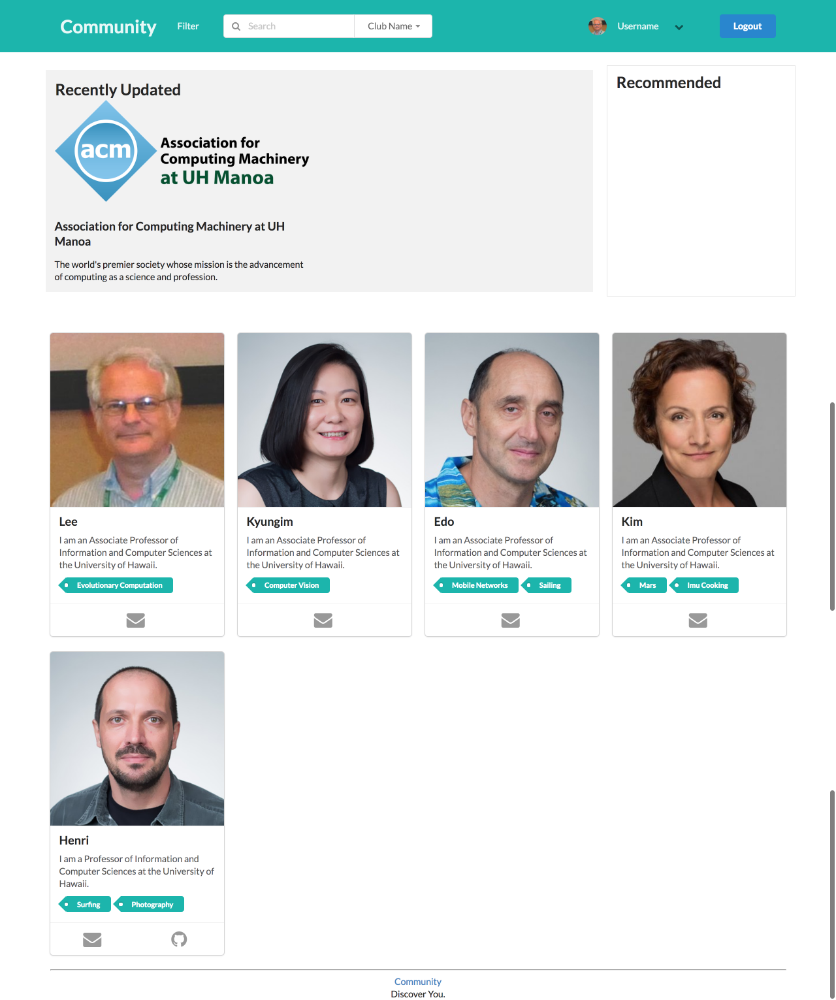

## Welcome to Community
The place to find your community on campus. With Community, you won't have to feel so alone anymore. People can filter for communities based on their interests, and get more information about those specific communities. Information such the name of the community, when and where the community meets, and what the community does. Registered individuals can input information about their organization, and let everyone know about certain inormation they would like shown.

## Screenshots

[Link](http://community.meteorapp.com/)

[Link](http://community.meteorapp.com/tcchong/profile)

[Link](http://community.meteorapp.com/tcchong/filter)

Admin Page is in the project, but unavailable for screenshots due to login issues.

## Links
[Organization](https://github.com/uhcommunity)
[M1 Project Page](https://github.com/uhcommunity/Community/projects/1)
[M2 Project page](https://github.com/uhcommunity/Community/projects/2)
[Deployment](http://community.meteorapp.com/)
